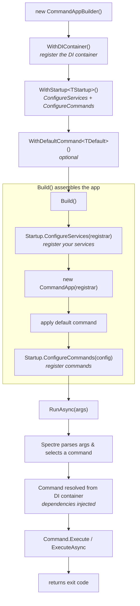

[](https://github.com/d20Tek/Spectre.Console.Extensions/actions/workflows/spectre-console-extensions-ci.yml)
[](https://github.com/d20Tek/Spectre.Console.Extensions/actions/workflows/nuget-release.yml)
[](https://www.nuget.org/packages/D20Tek.Spectre.Console.Extensions/)
# d20Tek Spectre.Console Extensions

Extensions and helpers that streamline building Spectre.Console applications. This library focuses on reducing boilerplate around dependency injection, configuration, testing, and common CLI patterns.

It is designed for developers who want Spectre.Console’s power without hand‑rolling DI registrars, command wiring, or test harnesses.

## Overview
Spectre.Console is a strong foundation for building .NET CLI applications, but real-world apps quickly need:

- Dependency injection
- Configuration binding
- Command registration
- Testing infrastructure
- Reusable prompts and controls

This library provides a set of extensions that integrate these concerns cleanly into Spectre.Console’s CommandApp model.

## Features
- CommandAppBuilder — a fluent builder for configuring DI, commands, settings, and configuration.
- Dependency Injection Support — built-in support for Microsoft.Extensions.DependencyInjection, plus optional packages for Autofac, Lamar, LightInject, and Ninject.
- Configuration Binding — automatic binding of command settings from configuration sources.
- Testing Infrastructure — helpers for end-to-end command testing using CommandAppTestContext.
- Reusable Controls — additional prompts and helpers for common CLI scenarios.
- Sample Applications — practical examples demonstrating DI, configuration, and testing patterns.

## Why This Library Exists
Spectre.Console provides excellent primitives, but real-world CLI applications often require:

- Dependency injection
- Configuration
- Testability
- Structured command registration

Developers frequently end up writing custom DI registrars, configuration binders, and test harnesses. This library consolidates those patterns into a consistent, reusable set of extensions that I found useful in my own console applications.

## Quickstart

A minimal example showing DI, configuration, and command registration:

```
var builder = CommandAppBuilder.Create()
    .WithCommand<HelloCommand>()
    .WithConfiguration(args)
    .WithServices(services =>
    {
        services.AddSingleton<IMyService, MyService>();
    });

return builder.Build().Run(args);
```

A simple command:

```
public class HelloCommand : Command<HelloSettings>
{
    private readonly IMyService _service;

    public HelloCommand(IMyService service)
    {
        _service = service;
    }

    public override int Execute(CommandContext context, HelloSettings settings)
    {
        _service.Run();
        return 0;
    }
}
```

## Installation
This libraries are NuGet packages so they are easy to add to your project. To install these packages into your solution, you can use the NuGet Package Manager. In PM, please use the following command:
```  
// core package
PM > Install-Package D20Tek.Spectre.Console.Extensions -Version 1.57.1
// optional integration with Microsoft.Extensions.Configuration and Options binding
PM > Install-Package D20Tek.Spectre.Console.Extensions.Configuration -Version 1.57.1
// optional integration with .NET generic host
PM > Install-Package D20Tek.Spectre.Console.Extensions.Hosting -Version 1.57.1
// additional DI containers
PM > Install-Package D20Tek.Spectre.Console.Extensions.MoreContainers -Version 1.57.1
``` 

The D20Tek.Spectre.Console.Extensions.MoreContainers package adds support for Autofac, Lamar, LightInject, and Ninject.

To install in the Visual Studio UI, go to the Tools menu > "Manage NuGet Packages". Then search for D20Tek.Spectre.Console.Extensions and install it from there.

Read more about the current release in our [Changelog](CHANGELOG.md).

## Documentation
Full documentation lives in the [docs](docs) folder:
- [Introduction](docs/introduction.md) - what the packages are and the problems they solve.
- [Getting Started](docs/getting-started-detailed.md) - an end-to-end walkthrough, with links to targeted [guides](docs/getting-started-detailed.md#guides).
- [API Reference](docs/api-reference.md) - the complete public surface, split per topic and package.

## Usage
Once you've installed the NuGet package, you can start using it in your Spectre.Console projects.
If you would like basic information about how to build Spectre.Console CommandApps, please read: https://darthpedro.net/lessons-cli/.

### With CommandAppBuilder [recommended]
To add dependency injection into a CommandApp using the CommandAppBuilder, you can do the following in Program.cs:
```csharp
using D20Tek.Samples.Common.Commands;
using D20Tek.Spectre.Console.Extensions;

namespace DependencyInjection.Cli
{
    public class Program
    {
        public static async Task<int> Main(string[] args)
        {
            return await new CommandAppBuilder()
                             .WithDIContainer()
                             .WithStartup<Startup>()
                             .WithDefaultCommand<DefaultCommand>()
                             .Build()
                             .RunAsync(args);
        }
    }
}
```

And, you will need to create the following Startup.cs file:
```csharp
using D20Tek.Samples.Common.Commands;
using D20Tek.Samples.Common.Services;
using D20Tek.Spectre.Console.Extensions;
using Spectre.Console.Cli;

namespace DependencyInjection.Cli
{
    internal class Startup : StartupBase
    {
        public override void ConfigureServices(ITypeRegistrar registrar)
        {
            // register services here...
            registrar.Register(typeof(IDisplayWriter), typeof(ConsoleDisplayWriter));
            // or use registration extensions on WithLifetimes() to specify the container's ServiceLifetime.
            // registrar.WithLifetimes().RegisterSingleton<IDisplayWriter, ConsoleDisplayWriter>();
        }

        public override IConfigurator ConfigureCommands(IConfigurator config)
        {
            config.CaseSensitivity(CaseSensitivity.None);
            config.SetApplicationName("DependencyInjection.Cli");
            config.ValidateExamples();

            config.AddCommand<DefaultCommand>("default")
                .WithDescription("Default command that displays some text.")
                .WithExample(new[] { "default", "--verbose", "high" });

            return config;
        }
    }
}
```

#### CommandAppBuilder pipeline
The builder turns a few fluent calls into a fully wired `CommandApp`. Each stage adds one piece - the DI container, your startup, an optional default command - and `Build` assembles them so that when `RunAsync` executes, commands are resolved from the container with their dependencies injected:




### Verbosity-Aware Logging
Because the CommandAppBuilder bridges to a Microsoft.Extensions.DependencyInjection service collection, any command can already inject an `ILogger<T>` once logging is registered. To render log output through Spectre.Console with a minimum log level derived from a verbosity level, call `WithLogging` after configuring a DI container:
```csharp
using D20Tek.Spectre.Console.Extensions;
using D20Tek.Spectre.Console.Extensions.Settings;

return await new CommandAppBuilder()
                 .WithDIContainer()
                 .WithLogging(VerbosityLevel.Detailed)
                 .WithStartup<Startup>()
                 .WithDefaultCommand<DefaultCommand>()
                 .Build()
                 .RunAsync(args);
```

The verbosity level maps to a minimum `LogLevel` (Quiet -> Error, Minimal -> Warning, Normal -> Information, Detailed -> Debug, Diagnostic -> Trace). You can optionally supply a custom `IAnsiConsole` and configure how entries are rendered:
```csharp
builder.WithLogging(
    VerbosityLevel.Normal,
    console: AnsiConsole.Console,
    configure: options =>
    {
        options.IncludeCategory = true;
        options.IncludeTimestamp = true;
    });
```

You can also register the provider directly against an `ILoggingBuilder` using `AddSpectreConsole`:
```csharp
services.AddLogging(logging => logging.AddSpectreConsole(VerbosityLevel.Normal));
```

### Configuration and Options Binding
The separate `D20Tek.Spectre.Console.Extensions.Configuration` package adds Microsoft.Extensions.Configuration and Options binding to the builder without pulling those dependencies into the core package. After configuring a DI container, call `WithConfiguration` to build and register an `IConfiguration`, then `WithOptions<T>` to bind a section to a strongly typed, validated options class:
```csharp
return await new CommandAppBuilder()
                 .WithDIContainer()
                 .WithConfiguration()
                 .WithOptions<GreetingOptions>(GreetingOptions.SectionName)
                 .WithStartup<Startup>()
                 .WithDefaultCommand<GreetCommand>()
                 .Build()
                 .RunAsync(args);
```
By default `WithConfiguration` reads from an optional `appsettings.json` file and environment variables. Pass a configure delegate to customize the configuration sources. `WithOptions<T>` binds the named section and validates any data annotations on the options class. Any command can then inject `IConfiguration` or `IOptions<T>` through its constructor. Configuration values remain separate from command-line `CommandSettings`.

See the [package README](D20Tek.Spectre.Console.Extensions.Configuration/README.md) for full usage, and the [Configuration.Cli](samples/Configuration.Cli) sample for a runnable example.

You do not have to bind to a strongly typed options class. A command can also inject `IConfiguration` directly and read individual keys or sections:
```csharp
internal sealed class InfoCommand(IConfiguration configuration, IAnsiConsole console) : Command
{
    protected override int Execute(CommandContext context, CancellationToken cancellation)
    {
        var title = configuration["App:Title"];
        var version = configuration.GetValue<string>("App:Version");
        var features = configuration.GetSection("App:Features").Get<string[]>() ?? [];

        console.MarkupLineInterpolated($"[bold]{title}[/] v[yellow]{version}[/]");
        console.MarkupLineInterpolated($"Features: [green]{string.Join(", ", features)}[/]");
        return 0;
    }
}
```

### Generic Host Integration
The separate `D20Tek.Spectre.Console.Extensions.Hosting` package bridges Spectre.Console.Cli to the .NET Generic Host (`Microsoft.Extensions.Hosting`), so the host can own configuration, options, logging, hosted services, and lifetime while command types resolve from the host's service provider. See the [package README](D20Tek.Spectre.Console.Extensions.Hosting/README.md) for full usage, and the [GenericHost.Cli](samples/GenericHost.Cli) sample for a runnable example.

### Samples:
For more detailed examples on how to use D20Tek.Spectre.Console.Extensions, please review the following samples:

* [StoreFront-E2E](samples/StoreFront-E2E) - Flagship end-to-end sample: an interactive store CLI backed by EF Core + SQLite that combines the CommandAppBuilder pipeline, dependency injection, configuration/options binding, verbosity-aware logging, the currency and table controls, an interactive shell default command, and the testing helpers (unit, command, and end-to-end tests).
* [Basic Cli with DI](samples/Basic.Cli) - full listing for code in the Usage - Custom Code section above.
* [DependencyInjection.Cli](samples/DependencyInjection.Cli) - More elaborate use of Microsoft.Extensions.DependencyInjection registrar and resolver. Along with using the CommandAppBuilder to remove some of the creation complexity.
* [Autofac.Cli](samples/Autofac.Cli) - Use the Autofac DI framework to build type registrar and resolver.
* [Lamar.Cli](samples/Lamar.Cli) - Use the Lamar DI framework to build type registrar and resolver.
* [LightInject.Cli](samples/LightInject.Cli) - Use the LightInject DI framework to build type registrar and resolver.
* [Ninject.Cli](samples/Ninject.Cli) - Use the Ninject DI framework to build type registrar and resolver.
* [SimpleInjector.Cli](samples/SimpleInjector.Cli) - Use the SimpleInjector DI framework to build type registrar and resolver.
* [NoDI.Cli](samples/NoDI.Cli) - Use the CommandAppBuilder to configure a console app that does not use a DI framework.
* [InteractivePrompt.Cli](samples/InteractivePrompt.Cli) - Create an interactive prompt that can run other registered commands while remaining in the prompt.
* [Logging.Cli](samples/Logging.Cli) - Use WithLogging to enable verbosity-aware, Spectre-rendered logging and inject an ILogger&lt;T&gt; into a command.
* [Configuration.Cli](samples/Configuration.Cli) - Use WithConfiguration and WithOptions&lt;T&gt; to bind configuration and inject IOptions&lt;T&gt; into a command.
* [GenericHost.Cli](samples/GenericHost.Cli) - Bridge Spectre.Console.Cli to the .NET Generic Host so commands resolve from the host's service provider, injecting IOptions&lt;T&gt;, IAnsiConsole, and ILogger&lt;T&gt;.

### Flagship sample: StoreFront-E2E
The [StoreFront-E2E](samples/StoreFront-E2E) sample is a small but complete store CLI that demonstrates how the extension points fit together in one runnable application. It is organized as two projects:

* `StoreFront.Cli` - an interactive store front backed by an EF Core SQLite database.
* `StoreFront.Cli.Tests` - unit, command, and end-to-end tests that exercise the CLI using the library's testing helpers.

What it showcases:

* CommandAppBuilder pipeline wiring `WithDIContainer`, `WithConfiguration`, `WithOptions<StoreOptions>`, `WithLogging`, `WithStartup<Startup>`, and `WithDefaultCommand<ShellCommand>`.
* An interactive shell (built on `InteractiveCommandBase`) as the default command, so the catalog, checkout, receipt, and history commands can be run in a single resident session.
* Dependency injection of EF Core `StoreDbContext` and store services (`ICatalogService`, `ICheckoutService`, `IReceiptService`) into commands.
* Configuration binding from `appsettings.json` into a strongly typed `StoreOptions` (store name, currency culture, tax rate, and database path).
* Verbosity-aware logging injected as `ILogger<T>` into the checkout service.
* The currency presenter and table separator controls used to render catalog listings and receipts.
* Database transactions: a checkout is persisted within an explicit EF Core transaction; receipts and history read those persisted transactions back.

Testing patterns it demonstrates:

* Service-level unit tests running against an isolated in-memory SQLite connection.
* Command-level tests using `CommandAppTestContext` with store services registered in the container.
* End-to-end tests using `CommandAppE2ERunner` that invoke the full builder pipeline against a temporary SQLite database.

Run it from the sample directory:

```powershell
dotnet run --project samples/StoreFront-E2E/StoreFront.Cli
```

Some commands to try:

```text
catalog
checkout --item COF-001:2 --item MUG-001:1
history
receipt 1
```


### Testing Infrastructure
This library also provides testing classes that help in building your CommandApp unit tests. Using the CommandAppTestContext allows you to easily configure and run commands in isolation.
Here is an example of a simple command unit test written in VSTest (though these test contexts will work in any test framework):
```csharp
//---------------------------------------------------------------------------------------------------------------------
// Copyright (c) d20Tek.  All rights reserved.
//---------------------------------------------------------------------------------------------------------------------
using D20Tek.Spectre.Console.Extensions.Testing;
using D20Tek.Spectre.Console.Extensions.UnitTests.Mocks;
using Microsoft.VisualStudio.TestTools.UnitTesting;
using Spectre.Console.Cli;
using System;
using System.Diagnostics.CodeAnalysis;
using System.Threading.Tasks;

namespace D20Tek.Spectre.Console.Extensions.UnitTests.Testing
{
    [TestClass]
    public class CommandAppTestContextTests
    {
        [TestMethod]
        public void Run()
        {
            // arrange
            var context = new CommandAppTestContext();
            context.Configure(config =>
            {
                config.Settings.ApplicationName = "Run Test 1";
                config.AddCommand<MockCommand>("test");
            });

            // act
            var result = context.Run(new string[] { "test" });

            // assert
            Assert.IsNotNull(result);
            Assert.AreEqual(0, result.ExitCode);
            StringAssert.Contains(result.Output, "Success");
            Assert.AreEqual("test", result.Context.Name);
            Assert.IsInstanceOfType(result.Settings, typeof(EmptyCommandSettings));
        }
    }
}
```

## Feedback
If you use these libraries and have any feedback, bugs, or suggestions, please file them in the Issues section of this repository.
